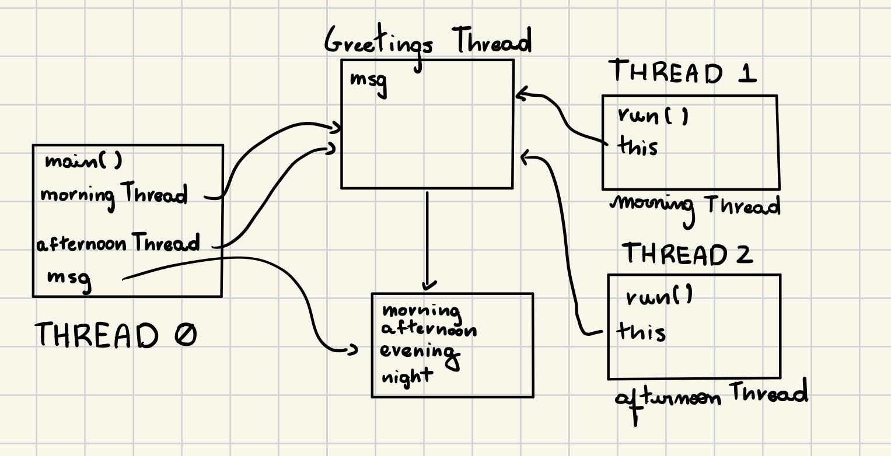

# Worksheet J6
## Question 1.
The program output has changed for everytime that I run it. Sometimes the afternoon thread starts before the morning thread, the number os greeting of a thread before the other is never the same. 


## Question 2.
I ran the program at least 5 times and for all these executions the similar was the same, with the afternoon thread being run first and the greetings interleaving one after another perfectly. The only difference is that sometimes one thread would finish before the other. 

## Question 3. 
Each thread is running its individual program in parallel with the other threads. When the two other threads start the main method keeps running simultaneously, and the program waits for all threads to be done to finish its execution. 

## Question 4.
Attempting to join the threads after 5 seconds makes sure that thread 1 will run for 5 seconds before the main thread and thread 2 start their executions. 

## Question 5. 
join() will wait for the thread that it is called upon to be done before executing the thread it is on. join(int delay) will wait for delay milliseconds before executing the thread it is on. 

## Question 6. 
isAlive() checks wether on not a thread is still running, and join() will wait for the thread to finish running. 

## Question 7. 
The program output shows that the Cheetah, will always finish first, then the Hare, and, finally, the tortoise. Even though the starting order may change. That happens because in the run function, each thread will sleep for a time inversely proportional to their speed.

## Question 8.
```java
public class AnimalFootRace {
    public static void main(String[] args) {
        Thread tortoiseThread = new AnimalRacerThread("Tortoise", 5);
        Thread hareThread = new AnimalRacerThread("Hare", 20);
        Thread cheetahThread = new AnimalRacerThread("Cheetah", 50);

        System.out.println("On your marks, get set, go!");
        tortoiseThread.start();
        hareThread.start();
        try {
            hareThread.join(5000);
        } catch (InterruptedException e) {
            System.out.println("Interrupted while sleeping...");
        }
        cheetahThread.start();
    }
}
```
The code starts hare and Tortoise threads, and after 5 seconds it starts the cheetah thread. The hare always wins. The program was modified by adding a `hareThread.join(5000)` statement, which makes the program wait for 5 seconds before continuing with the execution of the main function. 

## Question 9
```java
public class AnimalFootRace {
    public static void main(String[] args) {
        Thread snailThread = new AnimalRacerThread("Snail", 3);
        Thread tortoiseThread = new AnimalRacerThread("Tortoise", 5);
        Thread hareThread = new AnimalRacerThread("Hare", 20);
        Thread cheetahThread = new AnimalRacerThread("Cheetah", 50);

        System.out.println("On your marks, get set, go!");
        snailThread.start();
        tortoiseThread.start();
        hareThread.start();
        cheetahThread.start();
    }
}
```
I added a snail to my animal foot race, it was the sloweste animal I could think of. The print statements of each thread seem to happen in some sord of random order, but the order of total execution of the threads is always the same: Cheetah, Hare, Tortoise, and Snail. 

## Question 10.
Yes, it is possible to create two instances of the Singleton class by creating each instance on a different thread. As two threads can try to acess the getInstance() methods simultaneouly. 

## Question 11. 
Adding the synchronized identifier to the getInstance() method will make sure that, if there are multiple threads trying to access the method, all threads will wait for the first thread to finish the function execution.

## Question 12.
Because the JVM optimization will understand that the variable statusFlag is not altered within the scope of the SimpleThreadTwo thread, it will not check for any value changes and the while loop will keep on running forever. 

## Question 13. 
Now that the variable statusFlag has been declared as a volatile variable, the compiler will now know to keep updating its value because it may be changing in another thread. 

## Question 14. 
if two threads call the makeBid() method at the same time, what can happen is that they might both going to access the current value for currentHighestBid at the same time and update it in parallel. So the increase was not relative to the actual currentHighestBid, but only the currentHighestBid at the moment the method started being executed. 


